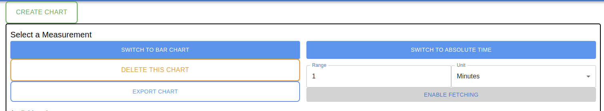
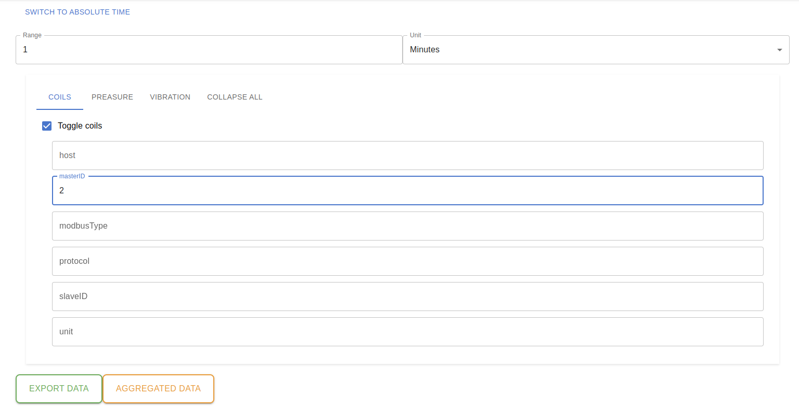
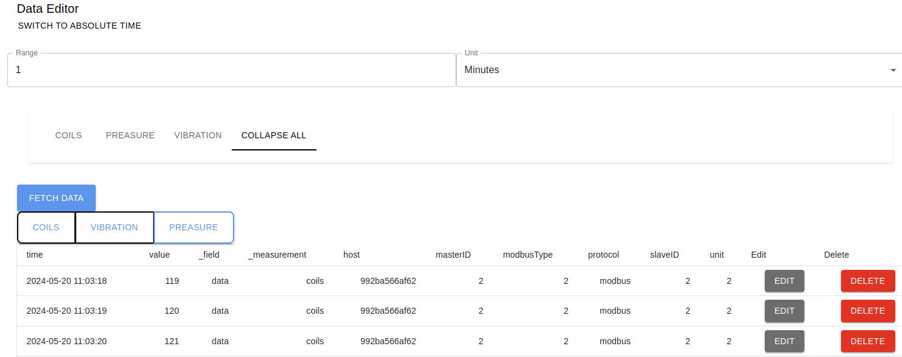

# Prumyslovy logovaci server 

Prumyslovy logovaci server slouzi ke sbirani a ukladani dat/logu z prumyslove site (napr. senzoricka data, sitovy provoz). Data jsou ukladana do databaze InfluxDB pomoci serveroveho agenta Telegraf. Pro uzivatelske rozhrani je vybrano FastAPI a Next.JS. Pro zobrazeni dat je vyuzita knihovna Chart.JS pro zobrazeni pomoci grafu. Vse je implementovano ve virtualizacnim softwaru docker-compose.


## Pozadavky

- System s OS linux (idealne Debian based)
- Python 3.8+ (a virtualni prostredi "venv")
- Docker 
- Docker-compose (vyuziva verzi formatovani 3.8)
- Sitove propojeni mezi prumyslovou siti a serverem


## Instalace

GitHub repozitar : https://github.com/bukajas/docker_app.git


### Prerequisites

Prumyslovy server vyuziva TLS certifikatu a klicu. Certifikaty mohou byt vyuzity vlastni, s tim ze se vyuzivaji v serverovem agentu Telegraf, a ve FastAPI backendu.
Momentalne jsou vygenerovane certifikay vlastne podepsane (self-signed), takze se muze stat ze nektere sluzby nebo prohlizece je budou brat jako neduveryhodne.
Z duvodu ze se predpoklada ze server bude spusten na lokalni siti, nebylo resena vlastni domena a oficialni TLS certifikaty.

### Steps

1. Naklonovani repozitare a vstoupeni do neho:

    ```sh
    git clone https://github.com/bukajas/docker_app.git
    cd docker_app
    ```


2. Nastaveni docker-compose konfiguracniho souboru
- Pred prvnim spustenim je zapotrebi nastavit nekolik promennych konfiguraci v docker-compose souboru pro promenne `env`

    ```sh
    ~/docker_app> vi env
    MYSQL_ROOT_PASSWORD=1234567890  #heslo pro root uzivatele do MySQL database
    MYSQL_USER="asszonyij"  #uzivatelske jmeno uzivatele do MySQL databaze
    MYSQL_PASSWORD=1234567890   #uzivatelske heslo uzivatele do MySQL database
    INFLUXDB_TOKEN="r0RAuA2MvqvHTntNNMvIW8TrEJFguyDFofcsFvZnGhiRHc7Bzw_IT5xGz2BeLeBbV82BD_1gXlcSFFYB0LaNUQ=="   #Pristupovy token pro InfluxDB a Telegraf. (postup nize)
    DOCKER_INFLUXDB_INIT_MODE=setup # Ponechat - rika ze pri prvnim spusteni se influxdb databaze inicializuje
    DOCKER_INFLUXDB_INIT_USERNAME=asszonyij     #InfluxDB - uzivatelke jmeno
    DOCKER_INFLUXDB_INIT_PASSWORD=1234567890    #InfluxDB - uzivatelske heslo
    DOCKER_INFLUXDB_INIT_ORG=VUT                #InfluxDB - nazev organizace
    DOCKER_INFLUXDB_INIT_BUCKET=school_data     #InfluxDB - nazev kybliku(databaze)
    ```
2. Prvni spusteni prumysloveho serveru a nastaveni:

    ```sh
    ~/docker_app> docker-compose up --build
    !!! Server ponechejte zapnuty !!!    

	#pri prvnim spusteni se vypise chybova hlaska pro spusteni FastAPI REST API
	#(sqlalchemy.exc.OperationalError: (pymysql.err.OperationalError) (2003, "Can't connect to MySQL server on 'docker-mysql' ([Errno 111] Connection refused)"))
	#duvodem je ze MySQL database je nastavena az po spusteni FastAPI, proto FastAPI se nemuze k databazi pripojit.	
    ```

- Nastaveni uvodniho uzivatele do uzivatelske databaze:

    ```sh
    python3 create_admin_user.py
    ```

- Zde budete vyzvani pro vyplneni zakladni uzivatelskych udaju k uzivateli s administratorskymi opravneni do prum. serveru.
- Tim se vytvori uzivatel s administratorskym pristupem do prumysloveho serveru.

    ```sh
    Enter MySQL root password: 1234567890
    Enter user name: test
    Enter plain password: test
    Enter user email: test@test.cz
    Enter user full name: test test
    ```

#### Ziskani InfluxDB pristupoveho tokenu
Bude zapotrebi nastavit novou promenou `INFLUXDB_TOKEN` v souboru `env` promenne 

1. 
    ```sh
    #Spusteni serveru - nebo je server zapnuty z predesleho kroku
    ~/docker_app> docker-compose up
    ```

2. Navigovat se do weboveho rozhrani InfluxDB database na portu 8888> [http://127.0.0.1:8888](http://127.0.0.1:8888)

3. Prihlaseni se pomoci pristupovych udaju `DOCKER_INFLUXDB_INIT_USERNAME` a `DOCKER_INFLUXDB_INIT_PASSWORD`

    4. Navigovani se do API token na prave strane viz obr.

    

    5. Navigovat na "GENERATE API TOKEN" a "Custom API Token"

    

    6. Vybrani "Buckets" a u zalozky "All buckets" vybrat "read" a "write"

    

    7. Stisknutim tlacitka generate se vygeneruje a zobrazy novy pristupovy token, kdy je potreba zkopirovat a aktualizovat do 
    promene v souboru `env` promenne `INFLUXDB_TOKEN`

    


4. Restartovani docker-composer:

- Zastavte/vypnete bezici docker-copose a opet spustete (tentokrat bez agrumentu `--build`)

    ```sh
    ~/docker_app> docker-compose up
    ```

5. Server by mel uz spravne bezet.

- Uzivatelske rozhrani na portu 3000: [127.0.0.1:3000](http://127.0.0.1:3000) 
- REST API na portu 8000: [127.0.0.1:8000](https://127.0.0.1:8000)
- InfluxDB databaze na portu 8888: [http://127.0.0.1:8888](http://127.0.0.1:8888)

(nebo misto localhost IP adresa zarizeni)


## Generovani provozu a prumyslove site

Vsechny soubory pro provoz jsou v adresari `ind_network`

!!! Momentalne jsou certifikaty a adresy nastaveny tak aby to fungovalo s vyuzitim vlastne podepsanych certifikatu. !!!

### Generovani sitoveho provozu

Pro zachytavani prumysloveho provozu byl vyuzit software [Scapy](https://github.com/secdev/scapy)

Je k dispozici jeden skript ktery zachytava provoz a posila na serveroveho agenta Telegraf

Nachazi se v adresari `ind_network/scapy`

Zde je zapotrebi upravit podle pozadavku par hodnot a pro TLS pripojeni a internetove rozhrani na kterem bude zachytavat provoz.

- nastaveni certifikatu a uzivatelskych udaju
    ```sh
    telegraf_url = 'https://192.168.122.118:8186/telegraf'  # URL to send data to Telegraf
    auth = HTTPBasicAuth('test', 'test')  # Basic authentication
    ca_bundle = '/home/asszonyij/docker_app/testCA/myCA/ca.crt'
    client_cert = ('/home/asszonyij/docker_app/testCA/myCA/certs/client.crt', '/home/asszonyij/docker_app/testCA/myCA/private/client.key')
    ```
    a nastaveni internetoveho rozhrani

    ```sh
    network_interface = 'enp1s0'
    ```

- Spusteni zachytavace

    ```sh
    python3 sniff_network.py
    ```

### Generovani prumysloveho provozu pomoci Modbus

Pro simulaci prumysloveho site s vyuzitim prumysloveho protokolu slouzi knihovna [pymodbus](https://github.com/pymodbus-dev/pymodbus)

Nachazi se v adresari `ind_network/modbus`

Zde je opet zapotrebi nastavit spravne adresy a udaje o klicich a certifikatech.

Pripadne lze nastavit simulovane hodnoty

- Spusteni slave a master zarizeni

    ```sh
    #Slave zarizeni
    python3 Slave.py

    #Master zarizeni
    python3 Master_HTTP.py
    ```


## Mozne problemy

Muze se stat ze nekdy fastapi nebo nektere dalsi sluzby zahlasi chybu pri startu dockeru. napr:


    docker-fastapi     | sqlalchemy.exc.OperationalError: (pymysql.err.OperationalError) (1061, "Duplicate key name 'ix_server_users_id'")


Tuto chybu lze jednoduse odstranit restartovat serveru.


## Pouziti

### Zobrazeni dat


- Create chart : vytvoreni nove instance grafu
- Switch to bar/line chart : prepnuti typu grafu na liniovy nebo sloupcovy graf.
- Delete this chart : odstraneni dane instance grafu
- Export chart : exportovoni aktualniho zobrazeni grafu do PNG. 
- Switch to absolute/relative time : prepnuti mezi vyberem absolutniho a relativniho casu
- Samotny vyber casu
- Enable fetching : zapnuti monitorovani v realnem case, pravidelka aktualizace dat kazdou vterinu
- Select measurement and submit : Vyber mereni a jejich hodnot a nasledne pozadani databaze o tyto data
- Open right drawer : Dalsi moznost jeste detailnejsiho a specfictejsiho filtrovani
- Samotny vyber dat ktere budou zobrazena


### Export dat

- Vyber casoveho intervalu a hodnot jako u zobrazeni dat
- Export data : exportovani vybranych dat ve vybranem casovem intervalu ve formatu CSV.
- Aggregated data : exportovani agregovanych dat ve vybranem casovem okamziku.


### Odstraneni dat

- Vyber casoveho intervalu a hodnot jako u zobrazeni dat
- Delete data : odstraneni vybranych dat ve vybranem casovem intervalu


### Editovani dat

- Vyber casoveho intervalu a hodnot jako u zobrazeni dat
- Fetch data : dotaz pro ziskani dat z databaze
- Vyber mereni ("coils","vibration","preasure")
- Tabulka hodnot pro editovani
- Edit : moznost upravit konktetni hodnotu
- Delete : moznost odstraneni konkterni hodnoty

!! Pozor : muze se stat ze zmena nebude videt ihned, proto staci aktualizovat stranku a zmeny budou videt.


## Uzivatele
- noright : uzivatel bez jakychkoliv opravneni, uzivatel ziska pri registraci
- read : opravneni pro cteni a exportovani dat
- read + write : opravneni pro cteni, exportovani, editaci a odstraneni dat.
- admin : stejne jako read + write s moznost upravy uzivatelu a jejich roli a retencni doby.


### Postup kterym byly vytvorene CA a certifikaty vlastne podepsane
 ```sh

    cd ./CA/
    openssl genpkey -algorithm RSA -out ca.key -pkeyopt rsa_keygen_bits:2048
    openssl req -x509 -new -nodes -key ca.key -sha256 -days 365 -out ca.pem -subj "/C=US/ST=State/L=City/O=Organization/CN=MyCA"
    openssl genpkey -algorithm RSA -out telegraf.key -pkeyopt rsa_keygen_bits:2048
    openssl req -new -key telegraf.key -out telegraf.csr -subj "/C=US/ST=State/L=City/O=Organization/CN=localhost"
    openssl x509 -req -in telegraf.csr -CA ca.pem -CAkey ca.key -CAcreateserial -out telegraf.cert -days 365 -sha256
    mv telegraf.* ../telegraf/
 ```


